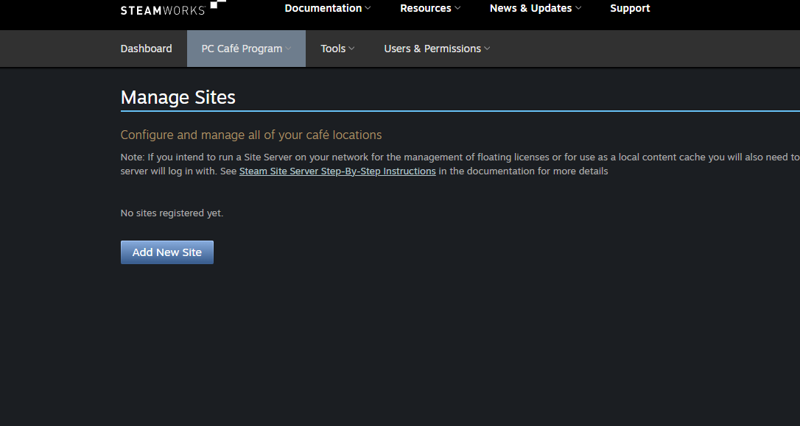

# Setting Up the Cybercafe Account 
Steamworks is the commercial program for the STEAM platform.  It covers developers and licences for cybercafes.
[Steamworks cybercafe documentation](https://partner.steamgames.com/doc/sitelicense)  
## [Getting Started](https://partner.steamgames.com/doc/sitelicense/licensees/gettingstarted)
## [PC Model](https://partner.steamgames.com/doc/sitelicense/licensees/gettingstarted/licensemodelpc)

[Getting Started with a site server](https://partner.steamgames.com/doc/sitelicense/licensees/gettingstarted/licensemodelpc)

https://partner.steamgames.com/doc/sitelicense/licensees/gettingstarted/licensemodelpc
