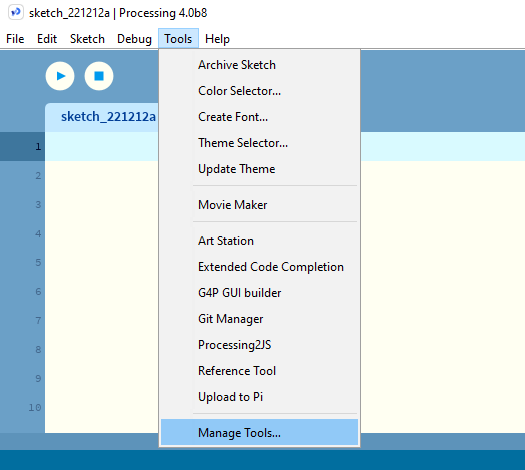
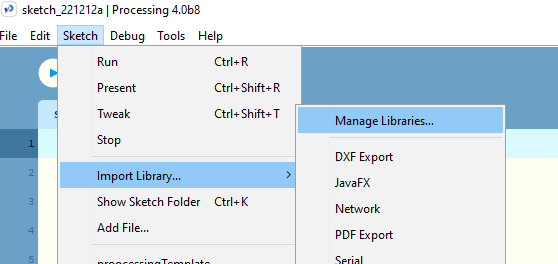

# Setting Up Processing with Android Mode 
## Installation Tutorial 
[Decent recent tutorial at geeksforgeeks](https://www.geeksforgeeks.org/how-to-set-up-processing-for-android/)
Issue| Solution / Comment
---|---
The Android emulator will not run properly from a USB or network share.|This is due to the lack of processor support software for the Emulator being installed on the machines. This is also why admin access is needed for the install. Each computer should install download the emulator software independently (sigh)
As of Dec 9 2020, Processing 4 has a bug where it does not list the available modes if selected from the Mode selection drop down.  This bug has been already created with an issue on Github.|A solution has been found to select either the `Manage Tools...`  or to go through the `Manage Libraries` dialogue 
<strong>*** Important ***</strong> - if you have already opened the Modes dropdown list you may have to restart either Processing or your computer before you can attempt the preceeding "solution".

