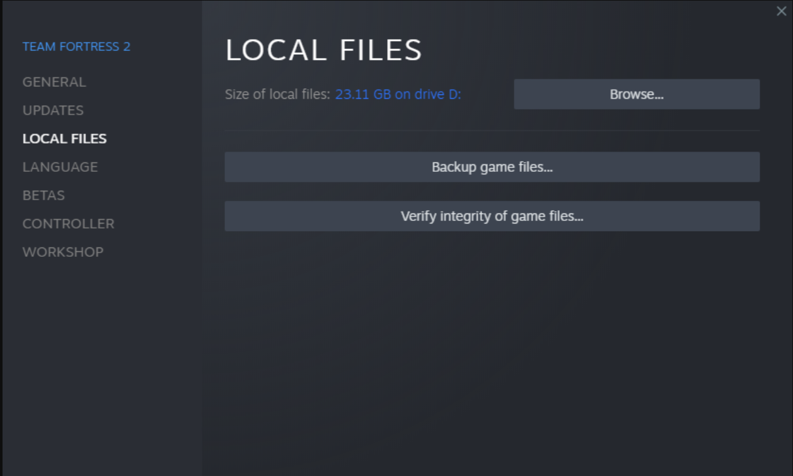
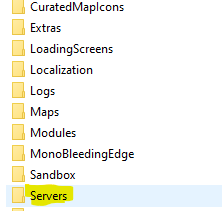

### Reference https://unturned.info/Server-Hosting/ServerHosting/#How-to-Install-SteamCMD-on-Windows
How to setup an Unturned dedicated server

# Step 1
## Download Required programs:
- Steam
- Unturned (using steam)
- Unturned Dedicated Server (using steam)

# Step 2
## Run Unturned dedicated server
When you open the unturned dedicated server it will start up the server for the first time. this will create the server files we will need to change in order to customize and rename the server. After you run it for the first time close out of it and continue to step 3.
# Step 3
## Open Unturned Dedicated Server files
On steam Right click Unturned Dedicated Server and select "Properties..." 

Navigate to Local files and click browse

In the Local files directory Navigate to the common tab, then the Unturned tab, then the Servers tab  and click through until you see the document titled "Commands.bat"

When inside the Command list you can only have one command per line, however you can add as many commands you want.
## Some commands you may want to add
### Name [Server name]
Changes the server name 
### Admin [SteamID/Player Name]
allows Admin players to use commands

### Cheats Enable
Enables Admins to use cheats

### Port 27015
Use this command to open a port which is used for LAN Sharing
### Loadout 255/15/15/81/81/18/20/20/121
Recomended loadout. uses item ids and adds them to your inventory everytime they spawn.
### Map PEI/Washington/Russia
Changes the servers map
# Step 4
## Joining the server

Once in game click "Play" and navigate to the "Connect" button.
Once your in the menu input the hosts IP in the first bar and 27015 into the second bar